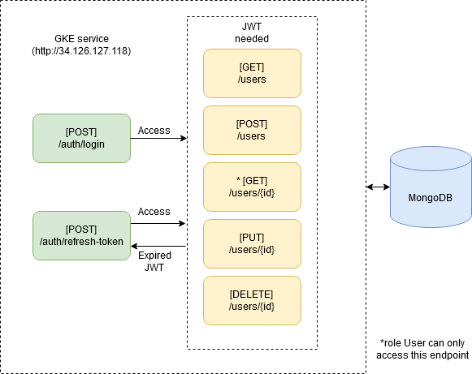

# Sejuta Cita Backend Internship Test

Candidate: **Alfian Maulana Ibrahim**. 

Simple API for user management purposes with JWT authentication. 

API is accessible on [Swagger Documentation](http://34.126.127.118/). 

Admin username: "admin" 

Admin password: "admin123" 

API also can be manually accessed on [http://34.126.127.118/](http://34.126.127.118/) which is an external load balancer IP deployed on Google Kubernetes Engine (GKE) service. 

Below is the architecture diagram of the flow of this API: 

 

This project was created using ExpressJS and MongoDB stacks.
